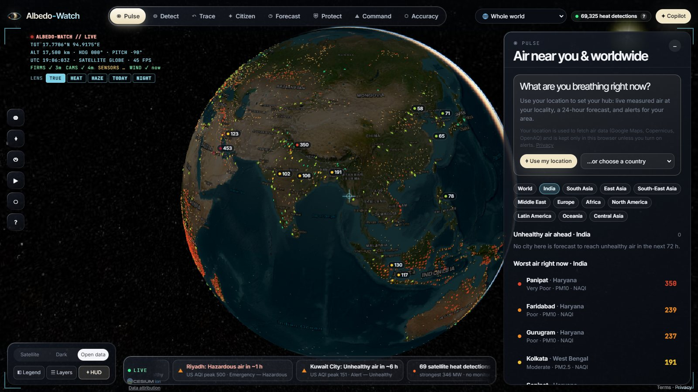
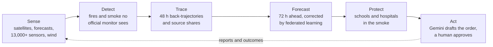
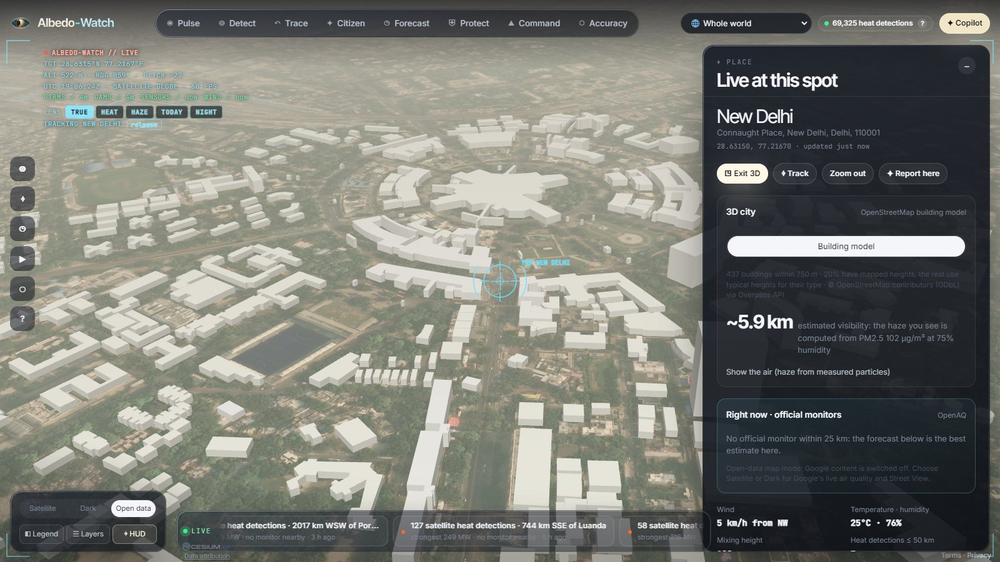
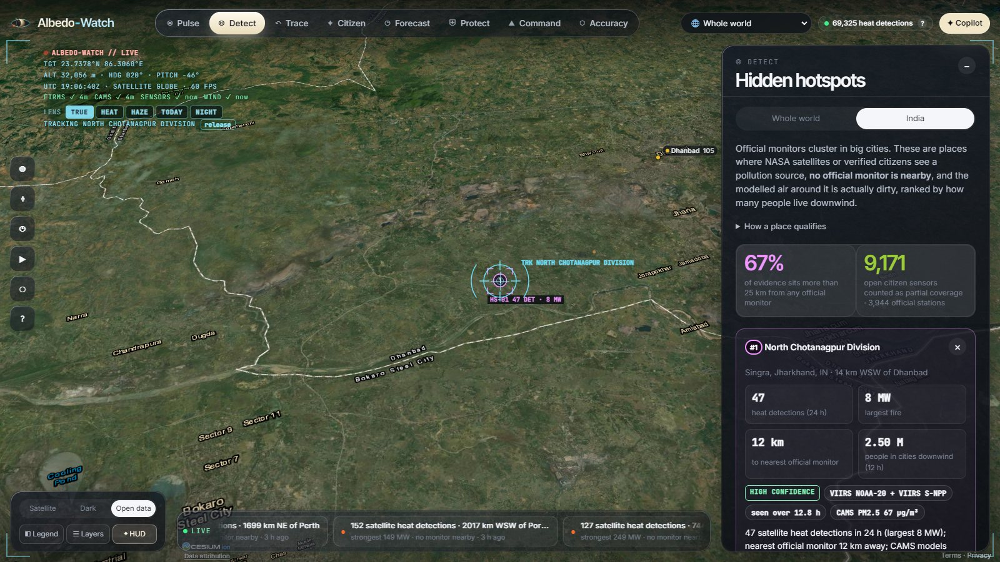
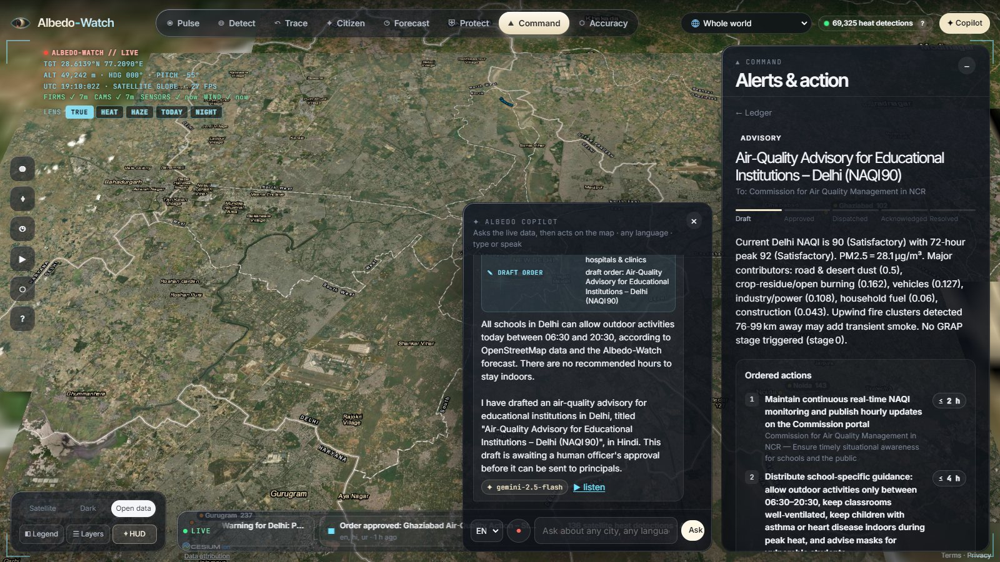
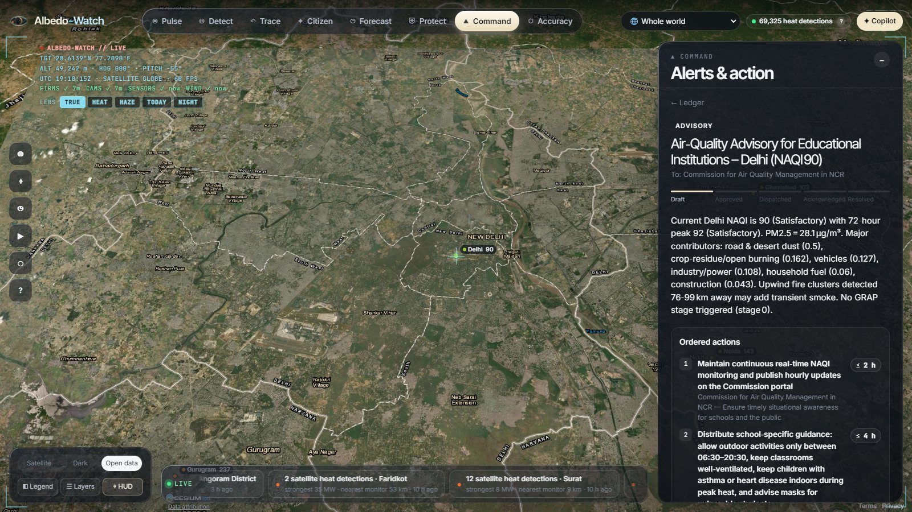
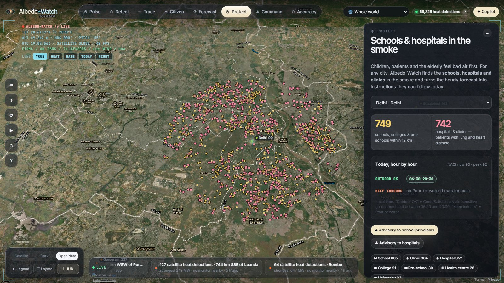
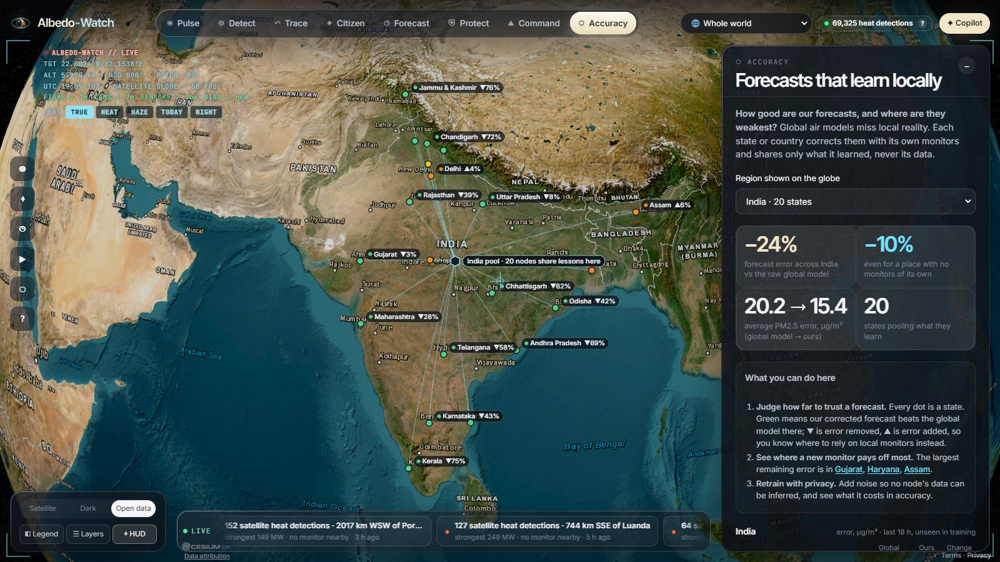
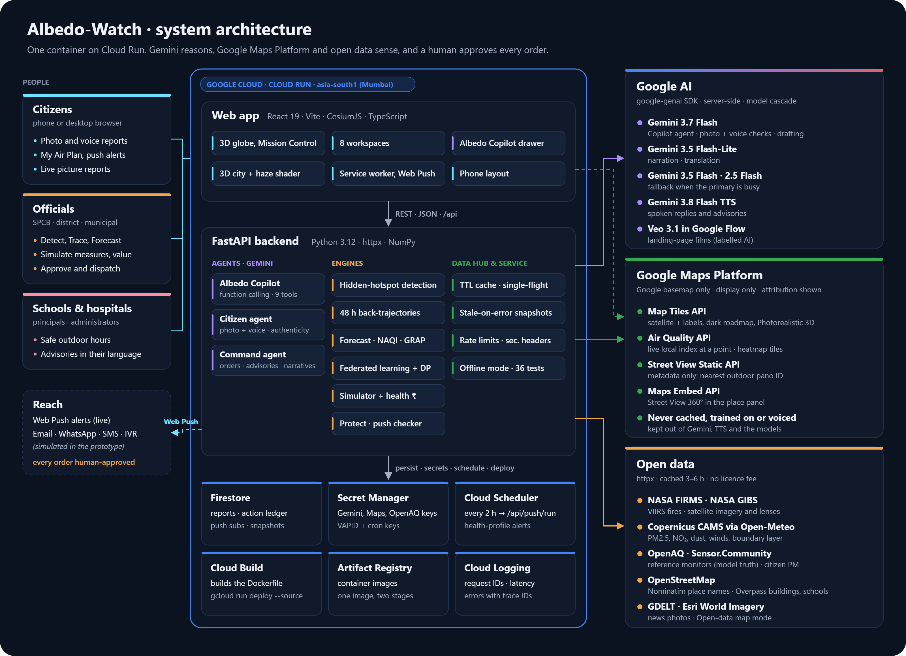

<div align="center">


# Albedo-Watch

**Air intelligence for India on a live 3D Earth.**<br>
Find the pollution no monitor sees, trace where it comes from, forecast it 72 hours ahead,<br>
protect the schools and hospitals in its path, and put a drafted order in front of the right official.

[](https://albedo-watch-621000818329.asia-south1.run.app/app)
[](#google-technology)
[](#google-technology)
[](#testing)
[](LICENSE)

**[Open the live app](https://albedo-watch-621000818329.asia-south1.run.app/app)** · [Home page](https://albedo-watch-621000818329.asia-south1.run.app) · [Architecture](#architecture) · [Compliance](#compliance-with-the-hackathon-rules-and-googles-terms)

*Build with AI: Code for Communities (2nd edition) · Track 2: Clean Air & Climate Resilience*

</div>



<sub>Screenshots in this README use the app's **Open data** map mode (Esri and NASA imagery), so they contain no Google Maps content. In the app the default basemap is Google's.</sub>

---

## Contents

- [The problem](#the-problem)
- [What Albedo-Watch does](#what-albedo-watch-does)
- [Features](#features)
- [Architecture](#architecture)
- [Google technology](#google-technology)
- [How the key parts work](#how-the-key-parts-work)
- [Compliance with the hackathon rules and Google's terms](#compliance-with-the-hackathon-rules-and-googles-terms)
- [Honest numbers](#honest-numbers)
- [Run it locally](#run-it-locally) · [Deploy to Google Cloud](#deploy-to-google-cloud) · [Configuration](#configuration)
- [API reference](#api-reference) · [Project structure](#project-structure) · [Testing](#testing)
- [Responsible AI and privacy](#responsible-ai-and-privacy) · [Limitations and roadmap](#limitations-and-roadmap) · [Credits and licence](#credits-and-licence)

## The problem

| | |
|---|---|
| **1.67 million** | deaths in India linked to air pollution in 2019, and **US$36.8 billion** of lost output (1.36% of GDP). *Lancet Planetary Health, 2021* |
| **≈550** | continuous monitoring stations for 1.4 billion people. Farms, kilns and small towns are never measured. *CPCB, approximate* |
| **Too late, too broad** | Warnings go out city-wide, in English, after the air has turned, with no named owner and nothing specific for a school or a clinic. |

The data to act on already exists: satellites see fires every day, global models forecast the haze, and citizens see smoke on their street. It rarely reaches the person who can do something about it, in their language, in time.

## What Albedo-Watch does



One product serves three groups of people:

| | What they get |
|---|---|
| **Officials** (State Pollution Control Boards, district and municipal administrations) | What is coming, where it comes from, what each response is worth in health and rupees, and a drafted order to approve |
| **Institutions** (schools, hospitals, clinics) | Safe outdoor hours and advisories in their own language |
| **Citizens** | A personal air plan, alerts before bad air arrives, and a way to report smoke by photo or voice in any language |

## Features

### Eight workspaces

| Workspace | What you can do | Built on |
|---|---|---|
| **Pulse** | Live air for 233 cities in 104 countries (India on CPCB's NAQI, elsewhere US AQI), your own hub, 72 h warnings | CAMS via Open-Meteo, federated correction, Google Air Quality API |
| **Detect** | Fires and smoke where no official monitor is watching, graded high, medium or low confidence, with the satellite image | NASA FIRMS, OpenAQ reference sites, NASA GIBS |
| **Trace** | Run the air 48 h backwards through the wind, see which fires it crossed, split PM2.5 by source, and simulate measures | Wind field, fire clusters, Gemini explanation |
| **Citizen** | Report by photo, voice note or text in any language; Gemini checks it, satellites corroborate it, and it is routed to the right office | Gemini multimodal, NASA FIRMS, OpenStreetMap |
| **Forecast** | 72 h outlook for India's economic corridors, time replay, GRAP stages | CAMS and the federated models |
| **Protect** | Schools, colleges, hospitals and clinics in a city, hour-by-hour safe outdoor windows, one-click advisories | OpenStreetMap (Overpass), hourly forecast |
| **Command** | Draft orders and advisories in English plus up to three local languages, approve, dispatch, and audit | Gemini, Firestore action ledger |
| **Accuracy** | How much the forecast can be trusted in each state, where a new monitor would help most, retraining with privacy noise | Federated learning (FedAvg + personalisation + DP) |

### Shared capabilities

| Capability | What it does |
|---|---|
| **Albedo Copilot** | A Gemini agent with nine tools over the app's own engines. One question in any language, typed or spoken, becomes a chain of tool calls, and the map follows each step. It stops at a draft that a person must approve. |
| **Click anywhere** | Any point on Earth: live air quality (Google, in the Google map modes), the forecast at that spot, fires within 50 km, nearby sensors and monitors, today's satellite image, and Street View 360°. |
| **3D city** | OpenStreetMap buildings (or Google Photorealistic 3D Tiles where Google's mesh exists), wrapped in haze computed from the forecast PM2.5 and humidity, with an estimated visibility in km. |
| **Satellite lenses** | NASA layers over the map: aerosol haze, land-surface heat, yesterday's true-colour pass, night lights. |
| **Live reports** | Picture notifications pinned on the globe: citizen photo reports, news photos about smoke (GDELT) and NASA views of new fires. |
| **My Air Plan** | A health profile (asthma, children, older adults, outdoor work and more) turns the forecast into your best hours outside, and Web Push alerts arrive before unhealthy air. You can turn them off, which deletes your data. |
| **Value of action** | Deaths, hospital admissions and rupees saved by a package of measures, as labelled estimates. |
| **Languages and voice** | 18 Indian languages in their own scripts, 85 languages worldwide, speech input and Gemini text-to-speech. |
| **Three map modes** | *Satellite* and *Dark* use Google's own tiles; *Open data* uses Esri and NASA imagery and turns every Google feature off. |
| **Open by design** | An open event protocol (JSON Schema and a GeoJSON feed) and a CC-BY model card with the federated weights. |

### Screenshots

<table>
<tr>
<td width="50%"><br><sub><b>3D city.</b> OpenStreetMap buildings; the haze and visibility come from the PM2.5 forecast here.</sub></td>
<td width="50%"><br><sub><b>Detect.</b> A hidden hotspot: satellite detections, no monitor nearby, confidence grade and image.</sub></td>
</tr>
<tr>
<td><br><sub><b>Albedo Copilot.</b> One question becomes find place → forecast → schools → draft notice.</sub></td>
<td><br><sub><b>Command.</b> The drafted order waits for an officer; every step goes on the ledger.</sub></td>
</tr>
<tr>
<td><br><sub><b>Protect.</b> About 750 schools and 740 hospitals and clinics in Delhi, with safe hours.</sub></td>
<td><br><sub><b>Accuracy.</b> One federation at a time; each state shows how much error the correction removes.</sub></td>
</tr>
</table>

## Architecture

<a href="docs/architecture.svg"></a>

<sub>Source: [docs/architecture.svg](docs/architecture.svg)</sub>

- **One container on Cloud Run** (asia-south1, Mumbai) serves the React single-page app and the FastAPI API. The Dockerfile builds the frontend with Node 22, then copies it into a Python 3.12 image.
- **The browser** renders the globe with CesiumJS. It loads Google map tiles, Photorealistic 3D Tiles, the Air Quality heatmap and the Street View embed directly from Google with a referrer-restricted key.
- **The backend** holds every other key in Secret Manager. It runs the Gemini agents and the numerical engines, and fetches open data through a cache with single-flight requests and stale-on-error snapshots in Firestore, so a cold instance answers at once.
- **Cloud Scheduler** calls `/api/push/run` every two hours to send health-profile alerts through Web Push.

## Google technology

| Product | What it does in Albedo-Watch | Where |
|---|---|---|
| **Gemini 3.7 Flash** (Gemini API, Google AI Studio) | The Albedo Copilot agent (function calling over 9 tools); multimodal checks of citizen photos and voice notes (source, severity, authenticity, transcript, translation); source explanations; orders and advisories in 18 Indian languages | `backend/app/agents/`, `backend/app/llm/` |
| **Gemini 3.5 Flash-Lite** | Short narration and translation | `backend/app/llm/` |
| **Gemini 3.5 Flash, 2.5 Flash** | Automatic fallback when the primary model is overloaded | `backend/app/llm/__init__.py`, `agents/copilot.py` |
| **Gemini 3.8 Flash TTS** | Spoken replies to citizens and read-aloud answers | `POST /api/tts` |
| **Veo 3.1 in Google Flow** | The home-page films and demo cutaways, labelled as AI-generated | `frontend/public/media/` |
| **Map Tiles API** | Google satellite tiles with Google labels, a dark-styled Google roadmap, Photorealistic 3D Tiles | `frontend/src/app/Globe.tsx` |
| **Air Quality API** | The live local index at a point (NAQI in India, each country's own index elsewhere), shown with Google attribution; the heatmap tile layer | `backend/app/sources/google.py`, `Globe.tsx` |
| **Street View Static API** (metadata only) | Finds the nearest outdoor Google panorama; only its pano ID is kept | `backend/app/sources/google.py` |
| **Maps Embed API** | Street View 360° in the place panel | `frontend/src/app/panels.tsx` |
| **Cloud Run** | Hosts the whole app, scales on demand | `Dockerfile` |
| **Cloud Build, Artifact Registry** | `gcloud run deploy --source .` builds and stores the image | – |
| **Firestore** | Citizen reports, the action ledger, push subscriptions, cold-start snapshots | `backend/app/store.py` |
| **Secret Manager** | Gemini, Maps, OpenAQ, VAPID and cron keys | Cloud Run config |
| **Cloud Scheduler** | Push-alert checks every 2 h | `/api/push/run` |
| **Cloud Logging** | Request logs with request IDs and latency | `backend/app/hardening.py` |
| **Google Fonts** | Inter, Inter Tight, JetBrains Mono, Noto Sans | `frontend/index.html` |

An optional OpenAI-compatible provider can answer **text-only** requests if every Gemini model fails. Photos, voice, text-to-speech and the Copilot's tool use are Gemini only. No Google Maps content is ever sent to any model.

### How a question flows through the Copilot

```mermaid
sequenceDiagram
    actor U as User (any language)
    participant W as Web app
    participant A as FastAPI /api/copilot
    participant G as Gemini 3.7 Flash
    participant E as Albedo-Watch engines
    U->>W: "Which schools in Delhi should keep children indoors? Notice in Hindi"
    W->>A: conversation
    loop until Gemini has what it needs (budget 100 s)
        A->>G: messages + 9 tool declarations
        G-->>A: function call, e.g. find_place("Delhi")
        A->>E: run the tool (registry, forecast, OpenStreetMap, simulator…)
        E-->>A: facts + a UI action (fly, open Protect, open draft)
        A->>G: function response
    end
    G-->>A: final answer
    A-->>W: answer, tool steps, UI actions
    W->>U: the map plays the actions; the draft waits in Command for approval
```

## How the key parts work

**Detect (hidden hotspots).** A place qualifies with at least 3 NASA VIIRS detections, or 40 MW of fire power, in 24 h, or a verified citizen report. Detections within 100 km merge into one complex. It must have no reference monitor nearby (6,560 OpenAQ sites) and dirty air around it (fires where CAMS sees PM2.5 under 12 µg/m³ are dropped). Complexes are then ranked by detection confidence and by the people living downwind within 12 hours.

**Trace (source attribution).** Seven air parcels are released around a city and run 48 hours backwards through the live wind field. Their paths are matched to NASA fire detections, and PM2.5 is apportioned between fire smoke and local sources. Gemini writes the explanation. This is a receptor-model proxy, not a chemical-transport model, and the app says so.

**Forecast and federated learning.** The Copernicus CAMS global forecast is corrected for each state or country by a small log-space linear model. Its features are CAMS PM2.5, wind, mixing height, humidity, hour of day and dust fraction.
- Each node trains on its own ground truth: hourly PM2.5 from the nearest OpenAQ reference monitors.
- Only the 8 weights travel. Nodes average them within regional federations (India's states form one), then personalise locally, with optional Gaussian noise for differential privacy.
- Every model is tested on the last 18 hours, which it never saw.

**Value of action.** Short-term effects over a 3-day episode:
- +0.65% all-cause deaths per 10 µg/m³ of PM2.5 (Orellano et al. 2020, WHO review), with India's crude death rate of 6.0 per 1,000.
- +1.9% respiratory admissions per 10 µg/m³ (WHO HRAPIE).
- Money uses an illustrative value of statistical life of ₹4 crore. Every figure is labelled an estimate.

**Haze and visibility in 3D.** Light extinction is b = 3·f(RH)·PM2.5 + 10 Mm⁻¹, with hygroscopic growth f(RH) = (1 − RH)^−0.55 capped at 4. Visibility = 3.912 / b (Koschmieder). The haze is a post-processing shader driven by the forecast PM2.5 at that spot.

**Push alerts.** Every two hours each subscribed hub is checked against its nearest city's corrected forecast and its health profile's threshold. A subscriber is notified at most once every 10 hours.

## Compliance with the hackathon rules and Google's terms

This section checks the project against the hackathon's rules and against the terms of every Google product it uses. The terms were read on 30 September 2026. Where a term required a change, the change is in commit `b94a8d5`.

### Hackathon rules

| Rule | How Albedo-Watch meets it |
|---|---|
| **01. Must integrate Google AI** (GenAI, predictive modelling or computer vision) | Gemini is the reasoning layer: an agent with function calling, computer vision on citizen photos and satellite images, speech understanding, drafting and TTS. See [Google technology](#google-technology). |
| **02. Built during the hackathon; pre-existing projects must be substantially extended** | The repository's history starts on 28 September 2026. Two small modules come from the author's earlier project ClimaTwin (request hardening and the LLM provider interface). Everything else is new; see [THIRD_PARTY_NOTICES.md](THIRD_PARTY_NOTICES.md). |
| **03. Original code or properly licensed open source, with citations** | All dependencies are permissively licensed (MIT, BSD, Apache-2.0; pywebpush is MPL-2.0, used unmodified). Every library, font and data source is cited in [THIRD_PARTY_NOTICES.md](THIRD_PARTY_NOTICES.md) and credited in the app. |
| **04. Cross-border applicability (BRICS)** | Built for India, with 53 cities in 26 states and UTs, NAQI, GRAP and each state's board. It already covers 104 countries, including every BRICS member, each with its own index, authorities and languages. A new country is a registry entry, not new code. |
| **Submission: working end-to-end flow, real data, built for India, multilingual/voice** | Live on Cloud Run with live data from NASA, Copernicus, OpenAQ, OpenStreetMap and Google. 18 Indian languages, voice input, voice replies. |

### Google Maps Platform terms

| Requirement | What Albedo-Watch does |
|---|---|
| **No use with non-Google maps** (Terms 3.2.3(e); Geocoding terms 6.2) | Google content only appears on Google basemaps. *Satellite* uses Google satellite tiles with Google's own label overlay at every zoom; *Dark* is a styled Google roadmap. The *Open data* mode (Esri and NASA) switches off every Google feature: live Air Quality, the heatmap, 3D tiles and Street View. |
| **No training or testing models on Google Maps content** (3.2.3(c)(vii)) | The federated models learn only from OpenAQ reference monitors. Google Air Quality data never enters a model, a prompt or a stored record. |
| **No caching beyond the allowed periods** (Service Specific Terms 2.2) | Air Quality current conditions are cached for at most 10 minutes (the limit is one hour). Street View keeps only pano IDs, which may be stored. Tiles are never pre-fetched or stored. |
| **No scraping, rehosting or Street View images outside the service** (3.2.3(a)) | The old server-side Street View image proxy was removed. Street View appears only through the Maps Embed API, and no Street View image is saved in orders. |
| **No Google Maps content in text-to-speech or generated content** (3.2.3(a)(iv), 3.2.3(c)) | Gemini prompts, TTS text and saved orders use open data only. Place names come from OpenStreetMap, and the 3D haze uses the app's own forecast. |
| **Geocoding results may not be cached across users** (Service Specific Terms 6.3) | Geocoding runs on OpenStreetMap Nominatim (ODbL, 1 request/s, cached), because place names are stored in reports and shared. |
| **Attribution** (3.2.2(b), Map Tiles and Air Quality policies) | The Google Maps logo and Google's data credits come from the tile sessions and are shown unmodified. Google Air Quality values carry a "Google Maps" label. Third-party credits are listed separately. |
| **End-user terms and privacy policy** (3.2.2(a); Geocoding and Street View policies) | [/terms](https://albedo-watch-621000818329.asia-south1.run.app/terms) links the Google Maps/Google Earth Additional Terms of Service and the Google Privacy Policy. [/privacy](https://albedo-watch-621000818329.asia-south1.run.app/privacy) explains what is collected. Both are linked from the app and the home page. |
| **Location privacy** (4.4(c)(iii)) | Location is used only after the browser asks. Your hub stays in your browser. Push subscriptions are opt-in and can be deleted with *Turn off*. Coordinates sent to Google are rounded to about 100 m. |
| **Promotional videos with map tiles** (Map Tiles policy) | Such videos must be 30 seconds or shorter and contain no Street View. The demo video is therefore recorded in *Open data* mode ([submission/DEMO-SCRIPT.md](submission/DEMO-SCRIPT.md)). |

### Gemini API, Google Flow and Google Cloud

| Requirement | What Albedo-Watch does |
|---|---|
| **Prohibited Use Policy; safety settings** | Gemini runs with `BLOCK_MEDIUM_AND_ABOVE`. Citizen text and audio are treated as data inside delimiters, as a guard against prompt injection. |
| **Users 18+; not directed at minors** | The Terms state the app is for adults. Protect speaks to principals and administrators, not to children. |
| **Unpaid quota: don't submit sensitive or personal data** | The report form asks people to leave out faces, names and personal details. Only a thumbnail of each photo is stored. |
| **Paid Services required for users in the EEA, the UK or Switzerland** | The prototype is built for India and the Terms ask people in those regions not to use the Copilot or reports. **Before any wider launch, use a Gemini key from a billing-enabled project (Paid Services).** |
| **AI-generated media** | The Veo films are labelled as AI-generated. Voice replies are labelled as Gemini's voice. |
| **Secrets** | Every key is in Secret Manager. The browser key is restricted by HTTP referrer and by API. |

### What an operator still has to do

- [ ] Use a Gemini API key from a **billing-enabled** Google Cloud project (Paid Services) before opening the app beyond India or collecting reports at scale.
- [ ] Keep API restrictions minimal. The browser key needs only Map Tiles, Air Quality and Maps Embed; the server key needs only Air Quality and Street View Static. The Geocoding API is no longer used.
- [ ] Records drafted before 1 October 2026 may contain Google Air Quality values or Street View links. Delete them from Firestore before a public pilot.
- [ ] Record demo videos in *Open data* mode, or keep any footage with Google map tiles to 30 seconds with no Street View, marked "for promotional purposes only".

## Honest numbers

Live values; they change with the data every few hours.

- **NASA heat detections:** about 47,000–69,000 per 24 h worldwide after merging the two VIIRS satellites' duplicate sightings. Most are small crop or vegetation fires (median about 5 MW), and some are gas flares. The app says so.
- **Official monitoring:** 6,555 OpenAQ reference sites active in the last 30 days, and about 9,000 open citizen sensors (Sensor.Community, uncalibrated, labelled as such).
- **Federated learning** (PM2.5 mean absolute error on the last 18 hours, unseen in training; ground truth from OpenAQ reference monitors): across India's 20 reporting states the global CAMS forecast is off by **20.2 µg/m³** and the federated, personalised model by **15.4 (−24%)**. A state with no monitors of its own, served by its federation, gets 18.1 (−10%). 14 of 20 states improve, and the app flags the 4 that get worse. Worldwide, with 33 nodes that have reference data, the error falls from 13.2 to 10.1 (−24%). *Snapshot of 1 October 2026.*

  Until 30 September the models learned from Google Air Quality history, which Google's terms do not allow for model training. On that truth India's error fell by about 42%. The figures above rest on official reference monitors instead.

## Run it locally

Requirements: Python 3.12+, Node 22+, and optionally a Gemini API key, Google Maps keys and an OpenAQ key.

```bash
python -m venv backend/.venv
backend/.venv/Scripts/pip install -r backend/requirements-dev.txt    # macOS/Linux: backend/.venv/bin/pip
cp backend/.env.example backend/.env                                # add your keys (see Configuration)
backend/.venv/Scripts/python -m uvicorn app.main:app --app-dir backend --port 8010
```

```bash
cd frontend && npm install && npm run dev                           # http://localhost:5173, proxies /api to :8010
```

Without keys the app still runs: Gemini features fall back to deterministic text, Google map modes fall back to *Open data*, and `OFFLINE=true` serves synthetic data for air-gapped demos and tests.

## Deploy to Google Cloud

```bash
PROJECT=your-project; REGION=asia-south1
gcloud config set project $PROJECT
gcloud services enable run.googleapis.com cloudbuild.googleapis.com artifactregistry.googleapis.com \
  firestore.googleapis.com secretmanager.googleapis.com cloudscheduler.googleapis.com \
  airquality.googleapis.com tile.googleapis.com street-view-image-backend.googleapis.com maps-embed-backend.googleapis.com
gcloud firestore databases create --location=$REGION

# secrets (repeat for server-api-key, openaq-api-key, vapid-private-key, cron-key)
printf %s "$GEMINI_API_KEY" | gcloud secrets create gemini-api-key --data-file=-

gcloud run deploy albedo-watch --source . --region $REGION --allow-unauthenticated \
  --set-secrets GEMINI_API_KEY=gemini-api-key:latest,SERVER_API_KEY=server-api-key:latest,OPENAQ_API_KEY=openaq-api-key:latest,VAPID_PRIVATE_KEY=vapid-private-key:latest,CRON_KEY=cron-key:latest \
  --set-env-vars GCP_PROJECT=$PROJECT,GOOGLE_BROWSER_KEY=<referrer-restricted key>,VAPID_PUBLIC_KEY=<public key>,CORS_ORIGINS=<service URL>

gcloud scheduler jobs create http albedo-push-check --location $REGION --schedule "0 */2 * * *" \
  --time-zone Asia/Kolkata --http-method POST --uri "<service URL>/api/push/run" --headers X-Cron-Key=<cron key>
```

## Configuration

| Variable | Purpose |
|---|---|
| `GEMINI_API_KEY` | Gemini API (Google AI Studio). Use a billing-enabled project in production. |
| `GEMINI_MODEL`, `GEMINI_FAST_MODEL`, `GEMINI_BACKUP_MODELS`, `GEMINI_TTS_MODEL` | Model cascade (defaults: 3.7 Flash, 3.5 Flash-Lite, 3.5 Flash + 2.5 Flash, 3.8 Flash TTS) |
| `SERVER_API_KEY` | Google Maps Platform server key: Air Quality and Street View metadata |
| `GOOGLE_BROWSER_KEY` | Referrer-restricted browser key: Map Tiles, Air Quality heatmap, Maps Embed |
| `OPENAQ_API_KEY` | OpenAQ v3: reference sites, latest values, hourly ground truth |
| `VAPID_PUBLIC_KEY`, `VAPID_PRIVATE_KEY`, `CRON_KEY` | Web Push and the scheduler's shared secret |
| `GCP_PROJECT`, `REPORT_STORE` | Firestore (`auto` falls back to memory when Firestore is unreachable) |
| `GROQ_API_KEY`, `CEREBRAS_API_KEY` | Optional text-only fallback if every Gemini model fails |
| `OFFLINE`, `CORS_ORIGINS`, `RATE_LIMIT_PER_MINUTE`, `LOG_LEVEL` | Operations |

## API reference

All endpoints are under `/api`. Interactive docs are at `/docs`.

| Area | Endpoints |
|---|---|
| Overview | `GET /health` · `GET /meta` · `GET /pulse` · `GET /overview` · `GET /city/{id}` · `GET /timeline` · `GET /corridors` |
| Live layers | `GET /wind` · `GET /fires` · `GET /sensors` · `GET /events` · `GET /live` |
| A point on Earth | `GET /place?lat&lon&google=0\|1` · `GET /buildings` · `GET /protect/point` |
| Detect, Trace, Act | `GET /hotspots` · `GET /attribution/{city}` · `POST /simulate` · `GET /protect/city/{id}` |
| Citizens | `POST /reports` · `GET /reports` · `GET /reports/{id}` · `POST /tts` |
| Command | `POST /alerts/draft` · `POST /alerts/{id}/status` · `GET /alerts` |
| AI | `POST /copilot` · `POST /ask` |
| Push alerts | `POST /push/subscribe` · `POST /push/unsubscribe` · `POST /push/test` · `POST /push/run` (scheduler only) |
| Federated learning | `GET /commons` · `POST /commons/train` |
| Open protocol | `GET /interop/schema` · `GET /interop/events.geojson` |

## Project structure

```
backend/
  app/
    agents/        copilot.py (Gemini agent + tools) · citizen.py (multimodal reports) · command.py (orders, narratives, Q&A)
    engines/       hotspots · attribution · forecast · naqi · federated · response · health · protect · push · place · datahub
    sources/       google (Air Quality, Street View metadata) · nominatim · osm · firms · gibs · openmeteo · sensors (OpenAQ, Sensor.Community) · news (GDELT) · cache
    llm/           Gemini provider, model cascade, optional text fallback
    routers/api.py every HTTP endpoint
    registry.py, world.py   India's states, cities, boards, languages; 104 countries
    store.py       Firestore with an in-memory mirror
    hardening.py   request IDs, security headers, rate limits
  tests/           38 offline tests
frontend/
  src/app/         MissionControl · Globe (CesiumJS) · panels · Protect · AirPlan · LiveToasts · hud · charts
  src/landing/     home page and films
  src/legal/       Terms of use and Privacy
  public/sw.js     Web Push service worker
docs/              architecture diagram, logo, screenshots
submission/        description, demo script, demo-video pipeline
Dockerfile         two-stage build: Node 22 (SPA) → Python 3.12 (API + static)
```

## Testing

```bash
backend/.venv/Scripts/python -m pytest backend/tests -q     # 38 tests, fully offline, no keys
cd frontend && npx tsc -b && npm run build
```

The tests cover NAQI breakpoints, GRAP stages, trajectory physics, fire coupling, source apportionment, federated convergence and differential privacy, and simulator monotonicity. They also check every API contract with AI disabled, and that the open-data place view and every AI input carry no Google Maps content.

## Responsible AI and privacy

- **A person approves every order.** Dispatch channels (email, WhatsApp, SMS, IVR) are simulated in the prototype.
- **Estimates are labelled.** Forecasts, attributions and health values are estimates, not official CPCB bulletins. Attribution is a proxy model.
- **Citizen reports are checked twice:** by Gemini (source, severity, authenticity) and independently against NASA fire detections and nearby reports.
- **Minimal data.** No accounts, no trackers, no cookies. Photos are stored only as small thumbnails, and your hub stays in your browser. See [/privacy](https://albedo-watch-621000818329.asia-south1.run.app/privacy).
- **O₃ and CO are left out of the headline NAQI** until they can be bias-corrected (CAMS ozone runs high along India's coasts).

## Limitations and roadmap

- OpenAQ's Indian feed can lag by about a day, so the federated models train on up to three days of overlap; more CPCB stations and longer windows will help.
- The attribution model is a receptor proxy; a chemical-transport model would be the next step for enforcement-grade evidence.
- Next: a 90-day pilot with one State Pollution Control Board before the stubble season; WhatsApp and SMS delivery of approved orders; IVR for citizens without smartphones; verifying each order's outcome from satellites and sensors.

## Credits and licence

Code: [MIT](LICENSE). Libraries, fonts and data are listed in [THIRD_PARTY_NOTICES.md](THIRD_PARTY_NOTICES.md):
- Copernicus CAMS via Open-Meteo (CC BY 4.0)
- NASA FIRMS and GIBS
- OpenAQ
- Sensor.Community (ODbL)
- OpenStreetMap (© OpenStreetMap contributors, ODbL)
- GDELT
- Esri World Imagery (Open data mode)
- Google Maps Platform, under the Google Maps Platform Terms of Service
